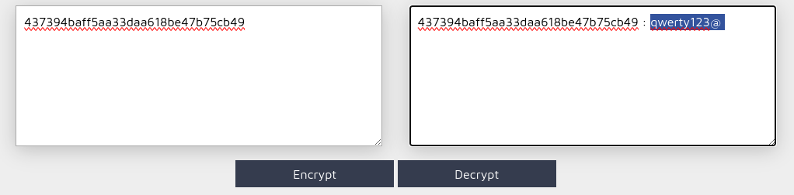

# Admin htpasswd

## Méthodologie

On a commencé par regarder ce qui se trouve dans le fichier `robots.txt` qui est placé à la racine du site (/robots.txt).

Puis on est allé voir ce qu'il se passait vers `/whatever` :

On a téléchargé `htpasswd` qui contenait un hash appartenant au root :

On a ensuite procédé à un déchiffrement après avoir déduit qu'il s'agissait d'un MD5.

On a donc supposé que le hash correspondait au mot de passe de l'admin :

Et là bingo !

## Détails de la faille
L’exposition du fichier `.htpasswd` est une faille critique, car elle permet à un attaquant d’accéder aux **identifiants d’administrateurs**.  
Cela peut être dû à :
- Une **mauvaise configuration du serveur** qui n’empêche pas l’accès direct au fichier.
- Une **mauvaise gestion des permissions** rendant le fichier lisible par n’importe quel utilisateur.

Une fois le mot de passe récupéré, l’attaquant peut **se connecter au panneau admin** et prendre le contrôle du site.

## Type de faille
- **Vulnérabilité** : Exposition de `.htpasswd` à cause d’une mauvaise configuration.
- **Impact** : Compromission des comptes administrateurs, accès aux données sensibles, possibilité d’exécuter des actions critiques.

## Conclusion
Une **exposition de `.htpasswd`** est une faille critique qui peut mener à une compromission totale du site web. **Tester l’accès direct et analyser les permissions** permet de détecter cette vulnérabilité et d’y remédier rapidement.
