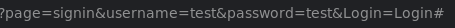
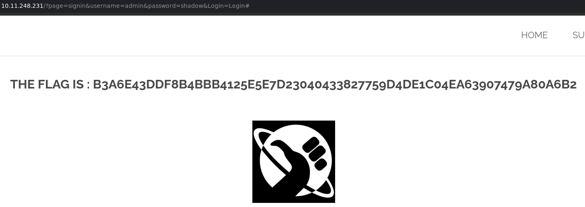

# Bruteforce Password
/?page=signin

## Méthodologie

Cette faille a été découverte lors d'une tentative de connexion sur le site. On remarque que le nom d'utilisateur et le mot de passe sont présents dans la requête URL, ce qui facilite les attaques par force brute via des requêtes automatisées.

En exécutant un programme de force brute avec le nom d'utilisateur admin et en testant les mots de passe les plus courants, le programme a révélé que le mot de passe était `shadow`.

## Détails de la faille
La faille Brute Force de mot de passe tire parti du fait que le mot de passe est transmis en clair directement dans l’URL du site.
Cela expose gravement les identifiants des utilisateurs, car les URLs peuvent être enregistrées dans l’historique du navigateur, les journaux du serveur, ou être interceptées via des connexions non sécurisées.

Dans ce cas, la requête de connexion inclut le mot de passe dans l'URL, ce qui facilite les attaques par force brute. Un attaquant peut automatiser des tentatives successives pour deviner les mots de passe et accéder aux comptes sans aucune protection.

## Type de faille
- **Vulnérabilité** : Transmission du mot de passe en clair dans l’URL.
- **Impact** : Exposition des identifiants sensibles, permettant des attaques par force brute et la compromission des comptes utilisateurs.

## Conclusion

Cette faille souligne l’importance de sécuriser la transmission des informations sensibles, en particulier les mots de passe.
Plusieurs bonnes pratiques doivent être mises en place pour prévenir ce type de vulnérabilité :

- **Ne jamais inclure de données sensibles dans l’URL** : Les informations comme les mots de passe doivent être transmises via des requêtes POST et non GET, afin d’éviter qu’elles apparaissent dans l’URL.
- **Utiliser le chiffrement des mots de passe** : Les mots de passe doivent être hachés (avec des algorithmes comme bcrypt, Argon2) avant d’être stockés ou manipulés.
- **Mettre en place des connexions sécurisées (HTTPS)** : Assurer que toutes les données échangées entre l’utilisateur et le serveur sont chiffrées pour éviter les interceptions.
Limiter les tentatives de connexion : Implémenter des mécanismes de protection contre les attaques par force brute, comme le blocage temporaire après plusieurs échecs ou l’utilisation de CAPTCHA.

Ces mesures permettent de renforcer la sécurité des données utilisateurs et de réduire considérablement les risques liés aux attaques par force brute.