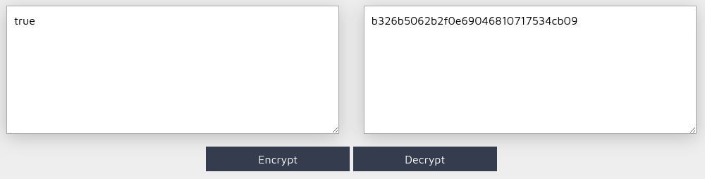

# Cookies

## Méthodologie

Nous avons <ins>inspecté</ins> l'état des <ins>Cookies</ins> dans <ins>Application</ins> et avons trouvé un hash lié à `I_am_admin`

On a ensuite procédé à un déchiffrement après avoir déduit qu'il s'agissait d'un MD5.

En voyant que le hash correspondait à `false` nous avons décidé de le changer en `true`

Et en rechargeant la page, bingo voici le flag !

## Détails de la faille
Les cookies sont souvent utilisés pour stocker des informations sensibles comme les **tokens de session** ou les **identifiants d’authentification**. Une mauvaise configuration peut exposer ces données à des attaques telles que :
- **Vol de session (Session Hijacking)** si le cookie n’a pas l’attribut **HttpOnly**.
- **Attaque XSS (Cross-Site Scripting)** si un script malveillant peut lire le cookie.
- **Attaque CSRF (Cross-Site Request Forgery)** si le cookie est utilisé sans protection adéquate.
- **Exploitation des cookies non sécurisés** (transmis en clair sur HTTP au lieu de HTTPS).

Un attaquant peut récupérer un cookie et l’utiliser pour usurper une session utilisateur légitime.

## Type de faille
- **Vulnérabilité** : Mauvaise configuration des cookies (absence de `HttpOnly`, `Secure`, `SameSite`, etc.).
- **Impact** : Vol de session, compromission de comptes, usurpation d’identité.

## Conclusion
Les cookies mal configurés peuvent être une **faille critique** permettant à un attaquant de prendre le contrôle d’un compte utilisateur ou d’accéder à des données sensibles. 

**Recommandations pour sécuriser les cookies** :
✔️ **Toujours utiliser `HttpOnly`** pour empêcher l’accès via JavaScript.
✔️ **Activer `Secure`** pour empêcher la transmission en clair sur HTTP.
✔️ **Configurer `SameSite=Strict`** pour limiter les attaques CSRF.
✔️ **Limiter la durée de vie des cookies** pour réduire le risque d’exploitation en cas de vol.

**Un simple cookie mal protégé peut suffire pour compromettre une session. Vérifiez vos configurations !**
