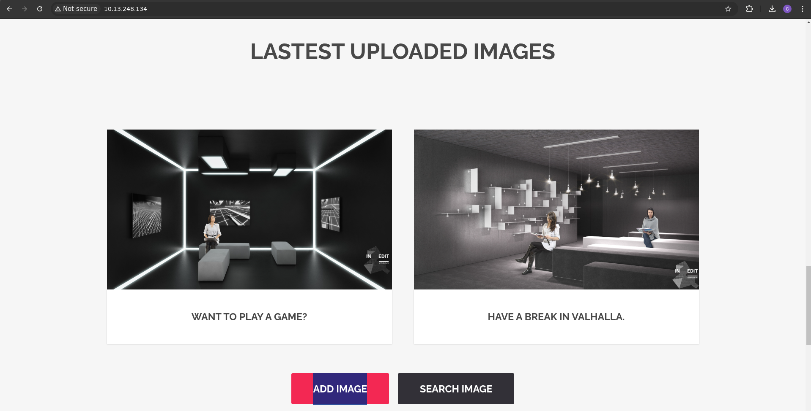
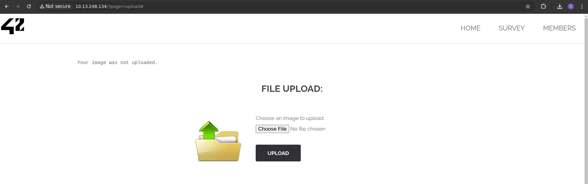
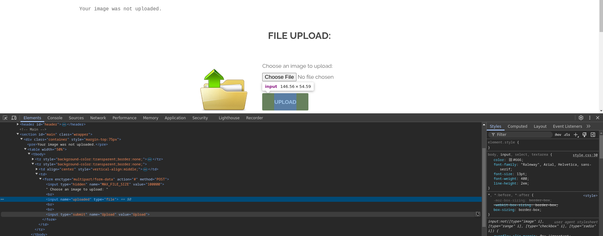
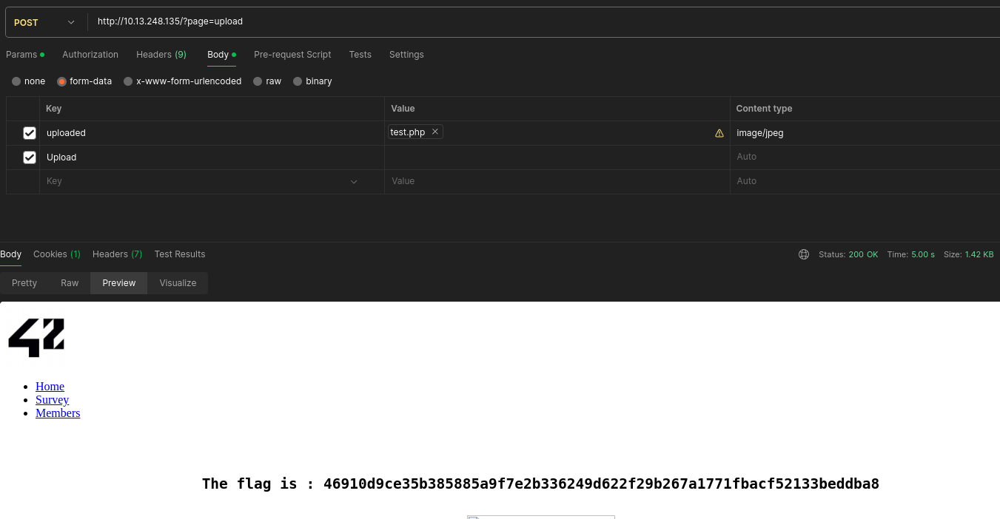

# File Upload
/index.php?page=upload

## Méthodologie

On a commencé par se rendre à l'endroit où l'on peut télécharger des images via la page d'accueil

On a ensuite remarqué que lorsqu'on essaie d'upload un fichier qui n'est pas un `.jpg`, l'image n'est pas téléchargée

On a donc <ins>inspecté</ins> le chemin d'upload et avons remarqué que le bouton *<ins>Choose file</ins>* se nomme *<ins>uploaded</ins>* et que le bouton *<ins>UPLOAD</ins>* se nomme *<ins>Upload</ins>*

On a finalement choisi de tenté notre chance avec l'application `Postman` en téléchargeant en dur un fichier `test.php` comme une `image/jpeg` et en là bingo !

## Détails de la faille
Une mauvaise gestion du téléversement de fichiers permet à un attaquant d’envoyer des fichiers malveillants et de les exécuter sur le serveur. Cela peut être dû à :
- **Absence de filtrage des extensions** (ex: accepter `.php`, `.exe`, `.jsp`).
- **Absence de validation côté serveur** (un attaquant peut contourner les restrictions client).
- **Téléversement dans un répertoire accessible et exécutable**.
- **Pas de contrôle MIME-Type**, permettant de déguiser un fichier malveillant en image.

Un attaquant peut exploiter cette faille pour :
- **Exécuter du code arbitraire sur le serveur** (ex: `webshell.php`).
- **Prendre le contrôle du serveur** en exécutant du code malveillant.
- **Stocker et diffuser des malwares**.
- **Exécuter des attaques de déni de service (DoS)** en envoyant des fichiers volumineux.

## Type de faille
- **Vulnérabilité** : Absence de contrôle sur le téléversement de fichiers.
- **Impact** : Exécution de code arbitraire, prise de contrôle du serveur, hébergement de malwares.

## Conclusion
Un téléversement de fichiers mal sécurisé peut mener à une compromission totale du serveur.

**Recommandations pour sécuriser le téléversement** :
- **Limiter les types de fichiers acceptés** (ex: uniquement `.jpg`, `.png`, `.pdf`).
- **Valider les fichiers côté serveur** (extension, MIME-Type, contenu réel).
- **Désactiver l’exécution des fichiers téléversés** (chmod, htaccess, sandbox).
- **Renommer les fichiers et stocker dans un répertoire non accessible publiquement**.
- **Analyser les fichiers avec un antivirus** avant stockage.

