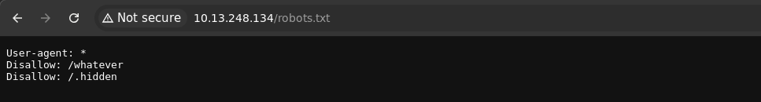
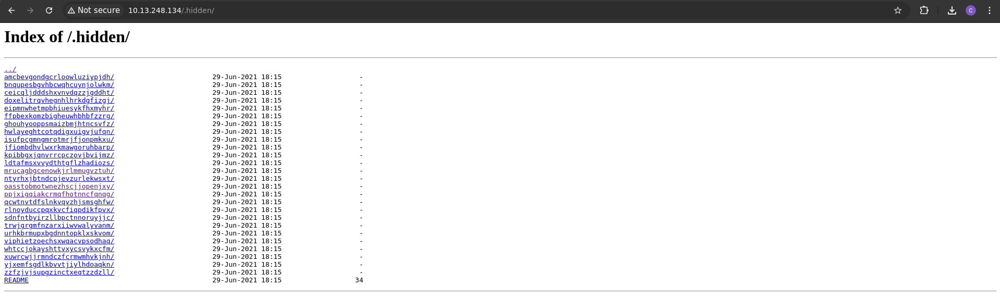

# Hidden File

## Méthodologie

On a commencé par regarder ce qui se trouve dans le fichier `robots.txt` qui est placé à la racine du site (/robots.txt).

Puis on est allé voir ce qu'il se passait vers `/.hidden` :

On a ensuite choisi de créer un script qui recherche un potentiel **flag** dans les README de chacun des fichiers :

## Détails de la faille
Les fichiers cachés peuvent contenir des informations sensibles accessibles par un attaquant si :
- **Ils ne sont pas correctement protégés** (ex: `.git`, `.env`, `backup.zip`).
- **Ils sont exposés par une mauvaise configuration du serveur**.
- **L’indexation du serveur permet de lister les fichiers**.
- **Des fichiers de sauvegarde non sécurisés existent** (`config.php.bak`, `database.sql`).

## Type de faille
- **Vulnérabilité** : Exposition involontaire de fichiers sensibles.
- **Impact** : Fuite d’informations, compromission de bases de données, accès non autorisé au serveur.

## Conclusion
Les fichiers cachés mal protégés peuvent exposer des données critiques aux attaquants.

**Recommandations pour sécuriser les fichiers sensibles** :
- **Configurer le serveur pour bloquer l’accès aux fichiers sensibles (`.htaccess`, `nginx.conf`)**.
- **Supprimer les fichiers inutiles et les anciennes sauvegardes**.
- **Utiliser des permissions strictes** (chmod, chown) pour restreindre l’accès.
- **Désactiver l’indexation des fichiers** pour éviter qu’ils soient listés.

