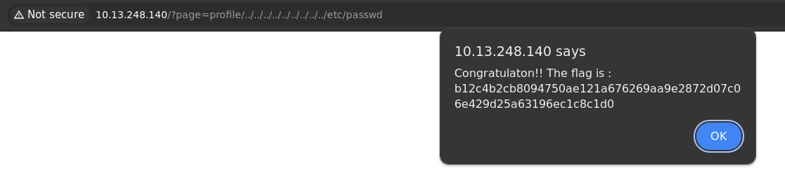

# Include

## Méthodologie

Nous avons tenté d'exploiter cette faille en modifiant un paramètre d'URL jusqu'à trouver le fichier local `/etc/passwd` :

## Détails de la faille
L’inclusion de fichiers non sécurisée est une vulnérabilité qui permet à un attaquant d’inclure des fichiers arbitraires dans une application web. Cela peut mener à :
- **Local File Inclusion (LFI)** : Inclusion de fichiers locaux du serveur (ex: `/etc/passwd`, `config.php`).
- **Remote File Inclusion (RFI)** : Inclusion de fichiers distants hébergés sur un serveur contrôlé par l’attaquant.

## Type de faille
- **Vulnérabilité** : Inclusion de fichiers non sécurisée (LFI/RFI).
- **Impact** : Lecture de fichiers sensibles, exécution de code arbitraire, prise de contrôle du serveur.

## Conclusion
Les attaques LFI/RFI sont **extrêmement dangereuses**, car elles permettent un accès non autorisé à des fichiers critiques ou l’exécution de scripts malveillants.

**Recommandations pour sécuriser les inclusions** :
- **Utiliser des chemins absolus** et éviter les variables utilisateur dans `include()` / `require()`.
- **Restreindre les fichiers accessibles** avec une **whitelist**.
- **Désactiver `allow_url_include`** pour empêcher les RFI.
- **Échapper et valider les entrées utilisateur** avant leur utilisation.
