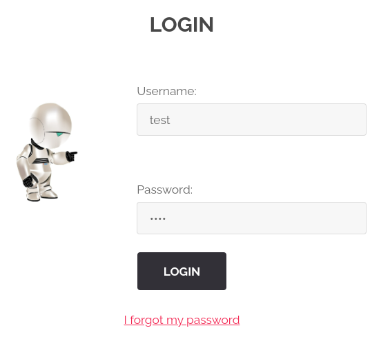
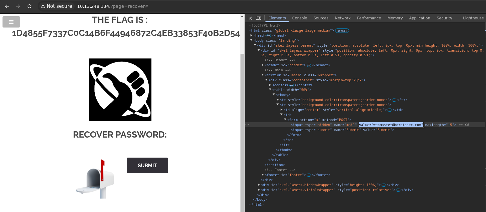

# Password Recovery
/index.php?page=recover

## Méthodologie

Cette faille est présente sur la page de récupération de mot de passe. Donc on a commencé par y accéder via la page de login en cliquant sur `I forgot my password`

On a ensuite constaté qu'il n'y a pas de champ pour saisir son adresse e-mail. En <ins>inspectant</ins>	le code de la page, on remarque que l'adresse e-mail est inscrite en <ins>dur</ins> dans le front-end. 

Il nous a simplement suffit de la modifier afin d'obtenir le flag :

## Détails de la faille
Les systèmes de récupération de mot de passe peuvent être exploités si :
- **Les tokens de réinitialisation sont prévisibles ou faibles** (ex: token basé sur l’horodatage).
- **L’identification repose uniquement sur l’email** sans vérification supplémentaire.
- **Les liens de réinitialisation ne sont pas invalidés après usage ou expiration**.
- **La réponse à la question secrète est trop facile à deviner**.

Un attaquant peut abuser de ces failles pour **prendre le contrôle d’un compte légitime**.

## Type de faille
- **Vulnérabilité** : Mauvaise gestion de la récupération de mot de passe.
- **Impact** : Usurpation d’identité, accès non autorisé à des comptes, compromission de données sensibles.

## Conclusion
Un système de récupération de mot de passe mal sécurisé peut être une **porte d’entrée majeure** pour les attaquants.

**Recommandations pour sécuriser le processus** :
- **Utiliser des tokens aléatoires, longs et uniques**.
- **Invalider les liens après usage ou expiration**.
- **Exiger une double vérification (ex: email + code SMS)**.
- **Limiter les tentatives pour éviter le bruteforce des questions secrètes**.
