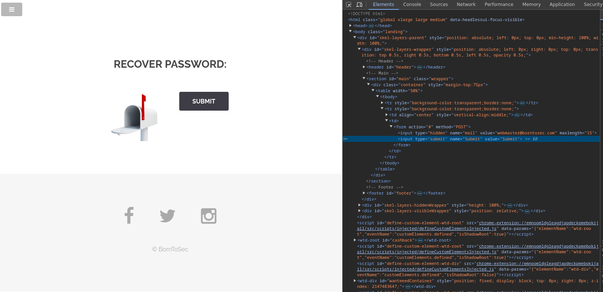

# Password Recovery
/index.php?page=recover

## Méthodologie

Cette faille est présente sur la page de récupération de mot de passe. Il n'y a pas de champ pour saisir son adresse e-mail. En inspectant le code de la page, on remarque que l'adresse e-mail est inscrite en dur dans le front-end. Il suffit alors de la modifier pour obtenir le flag.

## Détails de la faille
La faille d’exposition d’informations sensibles se trouve sur la page de récupération de mot de passe.
En effet, aucun champ n’est prévu pour saisir une adresse e-mail. Cependant, en inspectant le code source de la page, on découvre que l’adresse e-mail est codée en dur dans le front-end.

En modifiant directement cette adresse dans le code, il est possible de contourner le processus de récupération et d’obtenir le flag sans authentification ni vérification.

### Type de faille

- **Vulnérabilité** : Informations sensibles codées en dur dans le code source du front-end.
- **Impact** : Un attaquant peut manipuler les données côté client pour accéder à des informations ou des ressources protégées.

## Conclusion
Cette faille met en évidence un manque de sécurité dans la gestion des données sensibles côté client.
Le stockage d’informations critiques directement dans le front-end expose l’application à des attaques simples mais efficaces.

Pour corriger cette vulnérabilité, il est essentiel de :

- **Ne jamais inclure d’informations sensibles dans le code source** accessible aux utilisateurs.
- **Mettre en place un formulaire sécurisé** pour la récupération de mot de passe avec vérification côté serveur.
- **Valider et vérifier toutes les données côté serveur** afin d’éviter toute manipulation du client.

L’application gagnerait en sécurité en respectant ces bonnes pratiques, limitant ainsi les risques de compromission.