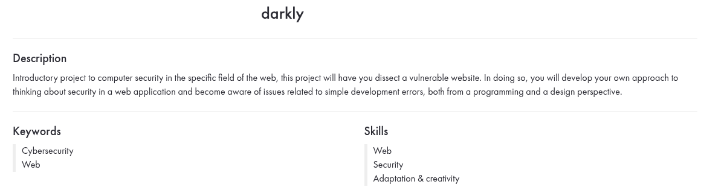

# DARKLY

# Top 10 OWASP (2021)
Ci-dessous une liste des vulnérabilités web les plus critiques ainsi que leur explications :

## 1. Broken Access Control (Contrôle d'accès insuffisant)

> [!NOTE]  
> Le *Broken Access Control* est une vulnérabilité de sécurité qui permet à des utilisateurs non autorisés d'accéder à des ressources ou d'effectuer des actions normalement restreintes.

> [!TIP]  
> Pour limiter les risques, il est conseillé d'utiliser une approche *deny by default* et de vérifier systématiquement les autorisations côté serveur, même si des contrôles existent côté client.

> [!IMPORTANT]  
> Une mauvaise gestion des contrôles d'accès peut entraîner des violations de données, la modification ou la suppression non autorisée de contenus, voire la prise de contrôle totale d’un système.

> [!WARNING]  
> Ne vous fiez jamais aux restrictions d’accès implémentées uniquement sur l’interface utilisateur (ex. boutons désactivés, éléments masqués). Un attaquant peut facilement les contourner via des outils comme Burp Suite ou l’inspecteur de navigateur.

> [!CAUTION]  
> Une mauvaise configuration des permissions (ex. rôles mal définis, API exposée sans authentification stricte) peut involontairement donner accès à des informations sensibles à des utilisateurs non autorisés.

*Exemple : Modifier un ID utilisateur dans l'URL pour consulter les données d'autres utilisateurs.*

| Breach        | Explication      |
| ------|-----|
| [admin htpassword](Admin%20htpasswd/) | Accès non autorisé à un fichier de protection par mot de passe |
| [hidden file](Hidden\File/) | Accès à des fichiers cachés pouvant contenir des informations sensibles |

## 2. Cryptographic Failures (Échecs cryptographiques)

> [!NOTE]  
> Les *Cryptographic Failures* désignent les failles de sécurité causées par une mauvaise utilisation ou une absence de chiffrement, exposant ainsi des données sensibles aux attaquants.  

> [!TIP]  
> Utilisez des algorithmes de chiffrement modernes et éprouvés comme AES-256 pour le stockage des données et TLS 1.2 ou 1.3 pour les communications sécurisées. Évitez les algorithmes obsolètes comme MD5 ou SHA-1.  

> [!IMPORTANT]  
> Le non-chiffrement ou un chiffrement mal implémenté peut entraîner des fuites de données, compromettant ainsi la confidentialité et l'intégrité des informations des utilisateurs.  

> [!WARNING]  
> Ne stockez jamais des mots de passe en clair ! Utilisez des fonctions de hachage sécurisées comme Argon2, bcrypt ou PBKDF2 avec un sel unique pour chaque utilisateur.  

> [!CAUTION]  
> Une mauvaise gestion des clés cryptographiques (ex. stockage en dur dans le code source, transmission non sécurisée) peut permettre à un attaquant d’accéder aux données chiffrées ou de les manipuler.

| Breach        | Explication      |
| ------|-----|
| [cookies](Cookies/) |Mauvaise gestion des cookies (ex. stockage de données sensibles non chiffrées, absence du flag Secure ou HttpOnly) |

## 3. Injection

> [!NOTE]  
> L’*Injection* est une vulnérabilité qui survient lorsque des données non fiables sont interprétées comme du code par une application. Cela inclut les attaques SQL, LDAP, NoSQL, OS command injection, et d'autres.

> [!TIP]  
> Utilisez toujours des requêtes préparées (*prepared statements*) et des ORM sécurisés pour interagir avec les bases de données. Évitez la concaténation de chaînes dans les requêtes SQL.  

> [!IMPORTANT]  
> Une attaque par injection peut permettre à un attaquant d'exécuter des commandes arbitraires, de voler ou modifier des données, voire de prendre le contrôle total du système.  

> [!WARNING]  
> Ne faites jamais confiance aux entrées utilisateur ! Toutes les données provenant d’utilisateurs, d’API ou de sources externes doivent être validées et filtrées avant d’être traitées.  

> [!CAUTION]  
> L’échappement manuel des caractères spéciaux peut être inefficace ou incomplet. Préférez des bibliothèques de sécurité éprouvées adaptées à chaque type d’injection (SQL, XSS, OS commands, etc.).

*Exemple : '; DROP TABLE users; -- dans un champ de formulaire, causant la suppression de la table.*

| Breach        | Explication      |
| ------|-----|
| [SQL injection](SQL\Injection/) | Injection SQL classique |
| [SQL advanced](SQL\Advanced/) | Injection SQL avancée (ex. blind SQL, time-based injections) |
| [XSS basic](XSS\Basic/) | Injection de scripts malveillants (Cross-Site Scripting simple) |
| [XSS advanced](XSS\Advanced/) | XSS avancé (ex. exploitation via DOM, persistant, ou dans des API JSON) |
| [include](Include/) | Inclusion de fichiers malveillants (ex. Local File Inclusion - LFI, Remote File Inclusion - RFI) |

## 4. Insecure Design (Conception peu sécurisée)

> [!NOTE]  
> *Insecure Design* fait référence à des failles de sécurité causées par une conception inadéquate des systèmes, plutôt qu’à des erreurs de mise en œuvre. Il s'agit d'un problème fondamental qui peut rendre une application vulnérable dès sa création.  

> [!TIP]  
> Intégrez des pratiques de *Security by Design* dès le début du développement, comme des analyses de menaces (*threat modeling*) et des revues de sécurité lors de la phase de conception.  

> [!IMPORTANT]  
> Une mauvaise conception de la sécurité peut mener à des vulnérabilités impossibles à corriger par des simples patchs, nécessitant parfois une refonte complète du système.  

> [!WARNING]  
> Ne comptez pas uniquement sur les tests de sécurité en fin de développement ! Une architecture mal pensée restera vulnérable, même avec des correctifs appliqués par la suite.  

> [!CAUTION]  
> L’absence de mécanismes tels que la limitation de taux (*rate limiting*), l’authentification forte ou la séparation des privilèges peut exposer une application à des attaques sévères comme le *DDoS*, le vol de sessions ou l’élévation de privilèges.

*Exemple : Une application qui permet de deviner les mots de passe avec des tentatives illimitées.*

| Breach        | Explication      |
| ------|-----|
| [survey](Survey/) | Mauvaise conception d’un formulaire (ex. absence de validation des entrées utilisateur) |
| [redirect](Redirect/) |  Redirections ouvertes permettant du phishing ou des attaques de type open redirect |

## 5. Security Misconfiguration (Mauvaise configuration de sécurité)

> [!NOTE]  
> *Security Misconfiguration* désigne les erreurs de configuration qui exposent une application à des risques de sécurité. Cela inclut des permissions trop larges, des fonctionnalités activées par défaut, des messages d’erreur détaillés ou des services inutiles laissés accessibles.  

> [!TIP]  
> Automatisez les configurations sécurisées avec des outils comme *Infrastructure as Code* (IaC) et appliquez le principe du moindre privilège sur tous les systèmes et services.  

> [!IMPORTANT]  
> Une mauvaise configuration peut permettre à un attaquant d’accéder à des données sensibles, d’exploiter des fonctionnalités non sécurisées ou de prendre le contrôle du serveur.  

> [!WARNING]  
> Ne laissez jamais des interfaces d’administration exposées sans protection adéquate (ex. panneaux d’administration accessibles publiquement sans authentification renforcée). Désactivez les comptes et accès par défaut.  

> [!CAUTION]  
> Garder des versions obsolètes de logiciels, utiliser des configurations par défaut ou exposer des logs sensibles dans les messages d’erreur peut faciliter des attaques comme l’exploitation de vulnérabilités connues ou le *brute force*.

*Exemple : Laisser un fichier .env accessible publiquement.*

| Breach        | Explication      |
| ------|-----|
| [file upload](File\Upload/) | Mauvaise configuration du système permettant l’upload de fichiers malveillants |
| [hidden file](Hidden\File/) | Présence de fichiers non sécurisés exposant des informations sensibles |

## 6. Vulnerable and Outdated Components (Composants vulnérables ou obsolètes)

> [!NOTE]  
> *Vulnerable and Outdated Components* fait référence à l'utilisation de bibliothèques, frameworks ou logiciels obsolètes contenant des failles de sécurité connues. Ces composants peuvent être exploités par des attaquants pour compromettre un système.  

> [!TIP]  
> Mettez en place un processus de gestion des dépendances, comme l'utilisation d’outils de surveillance des vulnérabilités (*Dependabot*, *Snyk*, *OWASP Dependency-Check*), et appliquez régulièrement les mises à jour de sécurité.  

> [!IMPORTANT]  
> Une seule dépendance vulnérable peut exposer toute une application à des attaques graves, comme l'exécution de code à distance (RCE), l'élévation de privilèges ou l'exfiltration de données.  

> [!WARNING]  
> Ne vous fiez pas uniquement aux mises à jour automatiques ! Certaines mises à jour de sécurité nécessitent une action manuelle pour être appliquées correctement, surtout sur des systèmes critiques.  

> [!CAUTION]  
> L’utilisation de composants non maintenus ou de bibliothèques téléchargées depuis des sources non officielles augmente le risque d’inclure des portes dérobées ou des malwares dans votre application.

*Exemple : Une ancienne version de jQuery vulnérable au Cross-Site Scripting (XSS).*

## 7. Identification and Authentication Failures (Défaillances d'authentification)

> [!NOTE]  
> *Identification and Authentication Failures* désigne les vulnérabilités liées à une mauvaise gestion de l’authentification et des sessions, permettant aux attaquants d’usurper l’identité d’un utilisateur légitime. Cela inclut l'absence de protections contre les attaques par force brute, l'utilisation de mots de passe faibles ou une gestion inadéquate des tokens de session.  

> [!TIP]  
> Implémentez l’authentification multifactorielle (MFA) pour renforcer la sécurité des comptes, et appliquez des politiques strictes sur la complexité et la rotation des mots de passe.  

> [!IMPORTANT]  
> Une faille dans l’authentification peut conduire à une prise de contrôle complète des comptes utilisateurs, exposant des données sensibles et compromettant l’intégrité de l’application.  

> [!WARNING]  
> Ne stockez jamais des mots de passe en clair ou avec un hachage faible. Utilisez des algorithmes sécurisés comme Argon2, bcrypt ou PBKDF2 avec un salage unique pour chaque utilisateur.  

> [!CAUTION]  
> Les sessions non protégées (ex. tokens exposés dans l’URL, absence d’expiration de session, absence de validation côté serveur) peuvent permettre le vol de session (*session hijacking*) et l’usurpation d’identité.

*Exemple : Absence de validation de session après un changement de mot de passe.*

| Breach        | Explication      |
| ------|-----|
| [bruteforce member](Bruteforce\member/) | Attaque par force brute sur un compte utilisateur |
| [passwd recover](Passwd\Recover/) | Vulnérabilité dans le processus de récupération de mot de passe |
| [spoof](Spoof/) | Usurpation d’identité ou falsification de données d’authentification |

## 8. Software and Data Integrity Failures (Intégrité logicielle et des données)

> [!NOTE]  
> *Software and Data Integrity Failures* désigne les vulnérabilités causées par l'absence de vérification de l'intégrité des logiciels, des mises à jour, des bibliothèques externes ou des données critiques. Cela peut permettre à un attaquant d'injecter du code malveillant ou de modifier des informations sensibles.  

> [!TIP]  
> Utilisez la signature numérique et des mécanismes de vérification d'intégrité (ex. HMAC, checksums) pour valider les mises à jour logicielles et les données critiques avant leur exécution ou utilisation.  

> [!IMPORTANT]  
> Le manque de contrôles d'intégrité peut entraîner l'exécution de code malveillant (ex. attaques par *supply chain*), la falsification de transactions ou la compromission de la confidentialité des utilisateurs.  

> [!WARNING]  
> Ne téléchargez jamais des mises à jour logicielles ou des bibliothèques à partir de sources non officielles. Un attaquant peut y insérer des portes dérobées ou des logiciels espions.  

> [!CAUTION]  
> L'utilisation de CI/CD non sécurisés, sans contrôle d'intégrité ou validation de code, peut permettre à un attaquant d'injecter des modifications malveillantes dans le pipeline de développement.

*Exemple : Utilisation de librairies provenant de sources non vérifiées.*

| Breach        | Explication      |
| ------|-----|
| [redirect](Redirect/) | Manipulation d’URL permettant une redirection non sécurisée |
| [spoof](Spoof/) | Altération de données (ex. modification de tokens, attaques sur la session) |

## 9. Security Logging and Monitoring Failures (Défaillances de journalisation et de surveillance)

> [!NOTE]  
> *Security Logging and Monitoring Failures* désigne l'absence, l'insuffisance ou la mauvaise configuration des journaux et des systèmes de surveillance, empêchant la détection et la réponse rapide aux incidents de sécurité.  

> [!TIP]  
> Mettez en place une journalisation centralisée et exploitable avec des solutions comme SIEM (*Security Information and Event Management*), et configurez des alertes pour détecter les comportements suspects en temps réel.  

> [!IMPORTANT]  
> Sans une surveillance efficace, les attaques peuvent passer inaperçues pendant des semaines ou des mois, augmentant les risques de compromission des données et de dégâts importants.  

> [!WARNING]  
> Ne stockez jamais des journaux sensibles (ex. mots de passe, tokens d’authentification, données personnelles) en clair, car cela peut exposer ces informations en cas de fuite ou d’accès non autorisé.  

> [!CAUTION]  
> Une mauvaise configuration des logs (ex. absence de conservation des logs, logs incomplets ou difficiles à analyser) peut compliquer l'investigation d'une attaque et empêcher une réponse efficace aux incidents de sécurité.

*Exemple : Un attaquant brute-force un compte sans alerte dans les logs.*

## 10. Server-Side Request Forgery (SSRF)

> [!NOTE]  
> *Server-Side Request Forgery (SSRF)* est une vulnérabilité qui permet à un attaquant d’abuser d’un serveur vulnérable pour envoyer des requêtes à des ressources internes ou externes, souvent contournant les protections réseau.  

> [!TIP]  
> Restreignez les requêtes sortantes côté serveur en mettant en place une liste blanche d’URL autorisées et en bloquant les accès non nécessaires aux adresses internes (*localhost*, *169.254.169.254*, etc.).  

> [!IMPORTANT]  
> Une attaque SSRF peut permettre à un attaquant d’accéder à des services internes sensibles, de récupérer des métadonnées cloud (AWS, Azure, GCP) ou d’exploiter des failles dans des services exposés.  

> [!WARNING]  
> Ne faites jamais confiance aux URL fournies par un utilisateur ! Validez et filtrez strictement les entrées avant d’effectuer une requête côté serveur.  

> [!CAUTION]  
> Une mauvaise gestion des erreurs dans les requêtes SSRF peut révéler des informations sensibles sur l’infrastructure, facilitant d’autres attaques comme le *port scanning* interne ou l’exfiltration de données.

*Exemple : Utiliser un formulaire pour accéder à des services internes via une URL malveillante.*
[x](Survey/)
