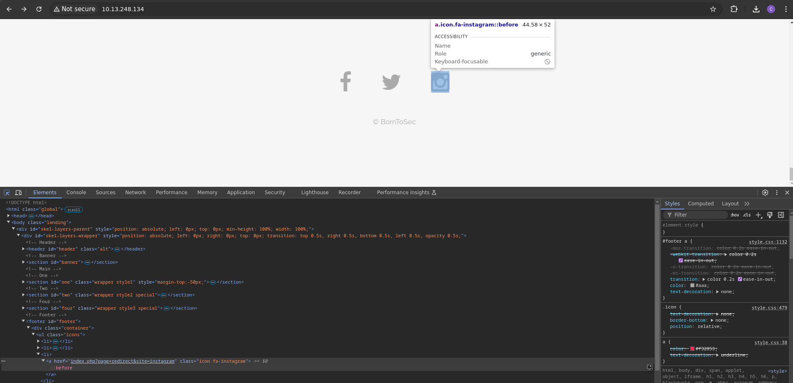
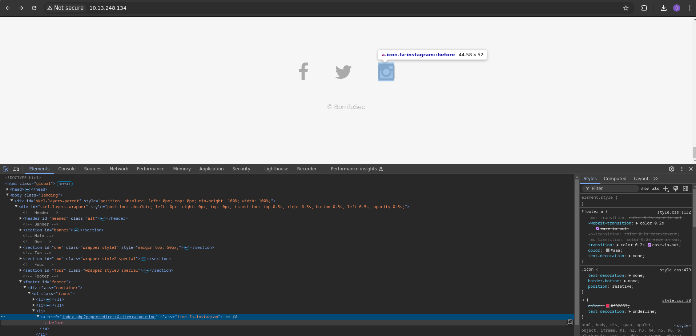
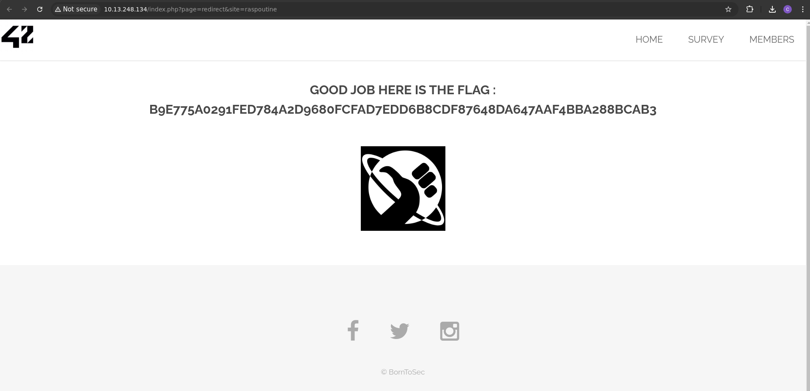

# Redirect

## Méthodologie

Tout en bas de la page d'accueil, il y a des redirections pour Facebook, Tweeter et Instagram.
En inspectant le code, on s'est rendu compte que le lien vers instagram était inscrit en dur :

On a donc essayé de changer le lien vers instagram en mettant autre chose :

Et en recliquant sur l'icone, bingo !

## Détails de la faille
Les redirections non sécurisées permettent à un attaquant de rediriger un utilisateur vers un site malveillant en exploitant une URL vulnérable. Cela peut être dû à :
- **L’acceptation d’entrées utilisateur non validées** dans des paramètres d’URL.
- **L’absence de restrictions** sur les destinations de redirection.
- **L’utilisation de liens trompeurs** pour du phishing.

Un attaquant peut exploiter cette faille pour :
- **Voler des identifiants** en redirigeant vers une fausse page de connexion.
- **Exécuter des attaques XSS/CSRF** en manipulant des requêtes redirigées.
- **Détourner du trafic** pour propager des malwares.

## Type de faille
- **Vulnérabilité** : Mauvaise gestion des redirections (Open Redirect).
- **Impact** : Phishing, vol d’informations, exécution de code malveillant.

## Conclusion
Les redirections non sécurisées sont une faille courante facilitant les attaques de phishing et l’exploitation d’utilisateurs.

**Recommandations pour sécuriser les redirections** :
- **Ne pas utiliser d’URL externe dynamique dans les paramètres sans contrôle**.
- **Restreindre les redirections aux domaines de confiance**.
- **Afficher une page d’avertissement avant toute redirection externe**.
- **Utiliser une liste blanche pour filtrer les destinations autorisées**.

