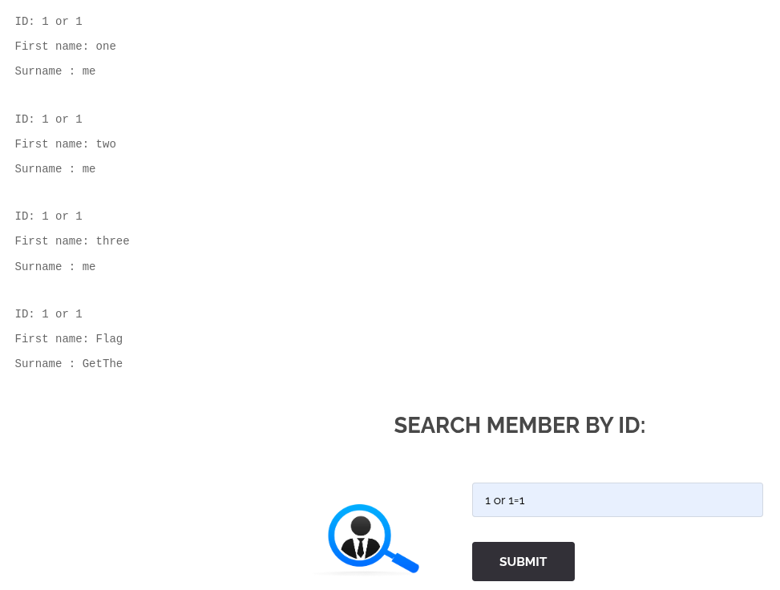
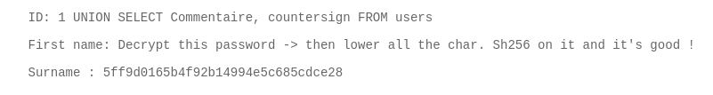

# SQL Injection
/index.php?page=member

## Méthodologie
Si on fait 1 OR 1 on remarque que les donnees de la table s'affiche

Du coup on pousse avec des commandes SQL et l'aide d'information_schema pour voir toutes les tables et leurs columns: "1 UNION SELECT table_name, column_name FROM information_schema.columns"

Puis on va chercher ddans la table qui nous interesse "users"

1 UNION SELECT Commentaire, countersign FROM users

## Détails de la faille
La faille d’injection SQL permet à un attaquant d’exécuter des requêtes SQL malveillantes sur une base de données en exploitant des entrées utilisateur mal filtrées.
Cette vulnérabilité survient lorsque les données saisies par un utilisateur sont directement intégrées dans une requête SQL sans être correctement validées ou échappées.

Un attaquant peut injecter du code SQL via un champ de formulaire, un paramètre d’URL ou toute autre entrée utilisateur afin d’accéder, modifier ou supprimer des données sensibles.

Par exemple, une requête vulnérable comme :

SELECT * FROM utilisateurs WHERE nom = '" + input_nom + "' AND mdp = '" + input_mdp + "';"

peut être exploitée avec une saisie comme :

' OR '1'='1

Ce qui transformerait la requête en :

SELECT * FROM utilisateurs WHERE nom = '' OR '1'='1' AND mdp = '';

Cette condition étant toujours vraie, l’attaquant pourrait contourner l’authentification et accéder à des comptes utilisateurs.

## Type de faille
- **Vulnérabilité** : Injection SQL due à un manque de validation des entrées utilisateur.
- **Impact** : Un attaquant peut lire, modifier ou supprimer des données sensibles, compromettre des comptes et, dans certains cas, exécuter du code malveillant sur le serveur.

## Conclusion
L’injection SQL est une des vulnérabilités les plus dangereuses pour les applications web, car elle peut exposer des données critiques et permettre des prises de contrôle complètes.

Pour se protéger contre cette faille, il est essentiel de :

- **Utiliser des requêtes préparées** (requêtes paramétrées) pour empêcher l’injection de code SQL malveillant.
- **Éviter la concaténation directe** des entrées utilisateur dans les requêtes SQL.
- **Mettre en place des contrôles stricts** de validation et de filtrage des entrées avant leur utilisation dans une requête.
- **Restreindre les permissions des comptes SQL** pour limiter les dommages potentiels en cas d’attaque.