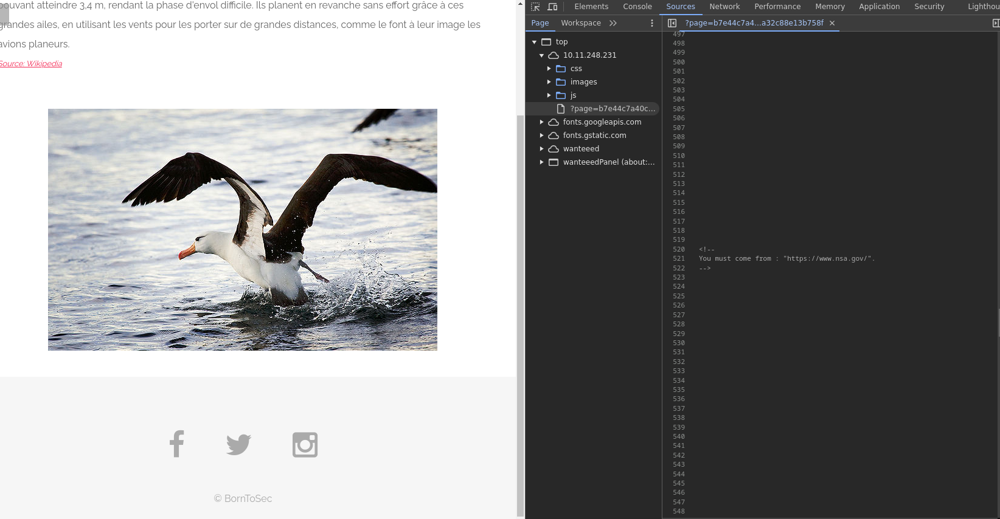
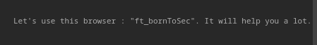

# Spoof redirect
/index.php?page=b7e44c7a40c5f80139f0a50f3650fb2bd8d00b0d24667c4c2ca32c88e13b758f

## Méthodologie

Cette faille est présente sur la page ci-dessus. En inspectant le code JavaScript de la page, on remarque des commentaires indiquant que l'utilisateur doit provenir de l'adresse `https://www.nsa.gov/`

Cependant, ajouter simplement un en-tête `Referer: https://www.nsa.gov/` dans la requête ne suffit pas. En explorant davantage la page, un autre commentaire caché révèle qu'il est nécessaire d'utiliser un navigateur personnalisé nommé `ft_bornToSec`.

Grâce à l'utilisation d'un plugin, il est alors possible de configurer le Referer et d’émuler le navigateur `ft_bornToSec`, ce qui permet de récupérer le flag.

## Détails de la faille

La faille de redirection non sécurisée permet à un attaquant de manipuler les paramètres de redirection d’une application web pour obtenir des privilèges non autorisés.
Dans ce cas, l’application redirige les utilisateurs vers des pages internes en fonction d’un paramètre d’URL sans vérifier si l’utilisateur a les droits nécessaires pour accéder à ces pages.

En modifiant manuellement l’URL de redirection, un attaquant peut accéder à des sections restreintes du site ou obtenir des droits d’administrateur sans authentification adéquate. Par exemple, une redirection vers une page d'administration peut être forcée simplement en altérant un paramètre.

### Type de faille

- **Vulnérabilité** : Redirection non sécurisée sans contrôle des autorisations d'accès.
- **Impact** : Un attaquant peut contourner les mécanismes d'authentification et obtenir des privilèges élevés, compromettant la sécurité de l’application.

## Conclusion
Cette faille de redirection non sécurisée met en évidence l’importance de contrôler rigoureusement les droits d’accès au sein d’une application.
L’absence de vérification des autorisations avant une redirection permet à un attaquant de contourner les mécanismes de sécurité et d’obtenir des privilèges non autorisés.

Pour prévenir ce type de vulnérabilité, il est essentiel de :

- **Valider strictement les paramètres de redirection** pour s’assurer qu’ils pointent uniquement vers des pages autorisées.
- **Implémenter des contrôles d’accès robustes** sur toutes les pages sensibles, indépendamment des redirections.
- **Éviter les redirections basées sur des paramètres d’URL** non vérifiés.

En appliquant ces bonnes pratiques, l’application renforce sa sécurité et réduit les risques d’escalade de privilèges ou d’accès non autorisé.