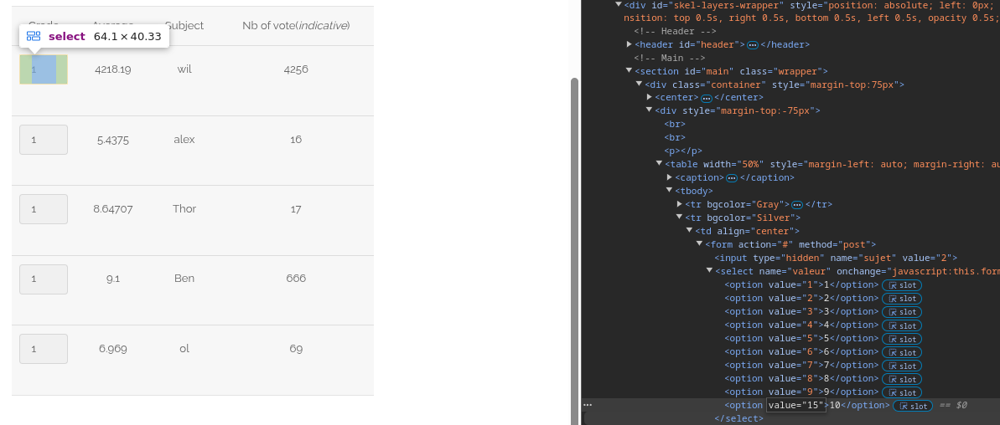

# Survey
/?page=survey#

## Méthodologie
Pour cette faille on a regarder le front de la page survey puis on a essayer de modifier les valeurs manuellement.
Si on modifie une des valeurs d'un des `<select>` avec une valeur superieur a 10 on accede au flag:

## Détails de la faille
La faille exploitée ici repose sur l'absence de validation des entrées côté serveur, permettant à un attaquant de modifier des valeurs d'un formulaire et d'obtenir un accès non autorisé à certaines fonctionnalités de l'application.

Dans ce cas, en inspectant le code source de la page survey et en modifiant manuellement les valeurs d'un champ <select>,
il a été possible de contourner les restrictions mises en place côté client.

Lorsque l'une des valeurs du <select> a été modifiée pour dépasser 10,
l'application a validé l'entrée sans vérifier sa légitimité côté serveur,
permettant ainsi d'accéder au flag.

## Type de faille

- **Vulnérabilité** : Absence de validation côté serveur des entrées utilisateur, permettant la modification de valeurs critiques.
- **Impact** : Un attaquant peut manipuler des données sensibles et obtenir un accès non autorisé à certaines fonctionnalités de l'application.

## Conclusion

Cette faille met en évidence l'importance de ne pas se fier uniquement aux contrôles effectués côté client.

Toutes les entrées utilisateur doivent être validées et filtrées côté serveur pour éviter toute manipulation malveillante.

Il est essentiel d'implémenter des contrôles stricts sur les valeurs acceptées par les champs de formulaire,
ainsi que des vérifications côté serveur pour s'assurer de l'intégrité des données soumises par les utilisateurs.