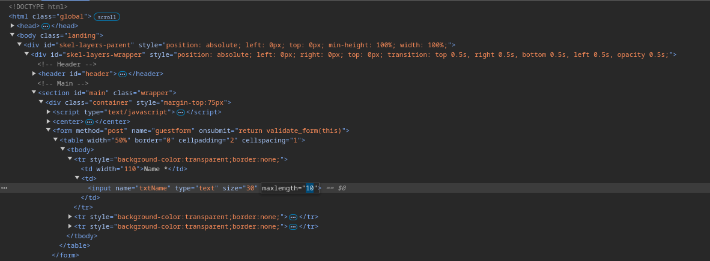
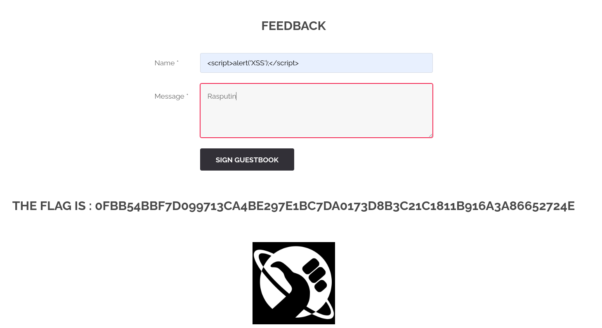

# Découverte de la faille XSS
/?page=feedback

## Méthodologie

Cette faille a été trouvée en exploitant une vulnérabilité liée à un champ de saisie non validé dans une application web. 
On a injecté du code JavaScript malveillant dans un champ de formulaire (ici dans "Name:" ``), 
et la vulnérabilité a été confirmée lorsqu'une alerte JavaScript a été exécutée sur la page cible.

Premièrement, il a fallut changer la taille allouée pour le texte dans "Name:" afin de pouvoir entrer tout le script:

Enfin, nous avons mit le script dans "Name:" et avons rempli le champ "Message:" pour finalement trouver cette faille:

## Détails de la faille

La faille **XSS (Cross-Site Scripting)** permet à un attaquant d'injecter du code JavaScript malveillant dans une application web. 
Si ce code est exécuté par un utilisateur qui consulte la page, cela peut conduire à des attaques comme le vol de cookies, 
l'exécution de commandes malveillantes, ou encore la redirection vers des pages de phishing.

Dans ce cas, la faille a été exploitée en injectant un script JavaScript dans un champ de formulaire non sécurisé. 
Le script a été ensuite exécuté dans le navigateur de la victime, permettant ainsi d'exécuter des actions malveillantes.

### Type de faille

- **Vulnérabilité** : Exécution de scripts malveillants via un champ de saisie non validé.
- **Impact** : Un attaquant peut voler des informations sensibles, comme les cookies d'une session active, ou rediriger l'utilisateur vers un site malveillant.

## Conclusion

Cette faille met en évidence l'importance de valider et d'assainir toutes les entrées utilisateur dans une application web. 
Il est essentiel d'utiliser des méthodes de filtrage ou d'échappement pour prévenir l'injection de scripts malveillants. 
Les applications doivent également appliquer des politiques de sécurité telles que la politique de sécurité de contenu (CSP) pour atténuer les risques liés aux attaques XSS.
